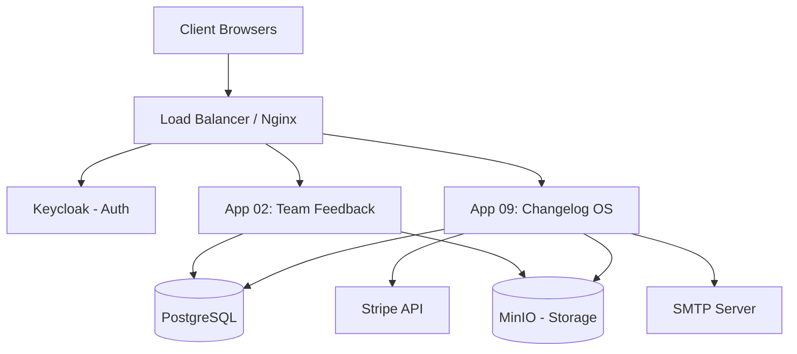
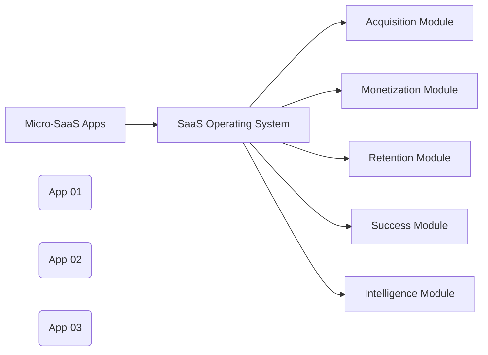

# Architecture Diagrams

## High-Level System Architecture

```mermaid
graph TD
    Client[Client Browsers] --> LB[Load Balancer / Nginx]
    LB --> Keycloak[Keycloak - Auth]
    LB --> App09[App 09: Changelog OS]
    LB --> App02[App 02: Team Feedback]
    App09 --> DB[(PostgreSQL)]
    App02 --> DB
    App09 --> Minio[(MinIO - Storage)]
    App02 --> Minio
    App09 --> Stripe[Stripe API]
    App09 --> Email[SMTP Server]
```

## Micro-SaaS Shared Infrastructure (SaaS OS)

```mermaid
graph LR
    SubGraph1[Micro-SaaS Apps]
    App1(App 01)
    App2(App 02)
    App3(App 03)
    SubGraph1 --> OS
    
    OS[SaaS Operating System]
    OS --> Acq[Acquisition Module]
    OS --> Mon[Monetization Module]
    OS --> Ret[Retention Module]
    OS --> Suc[Success Module]
    OS --> Int[Intelligence Module]
```
