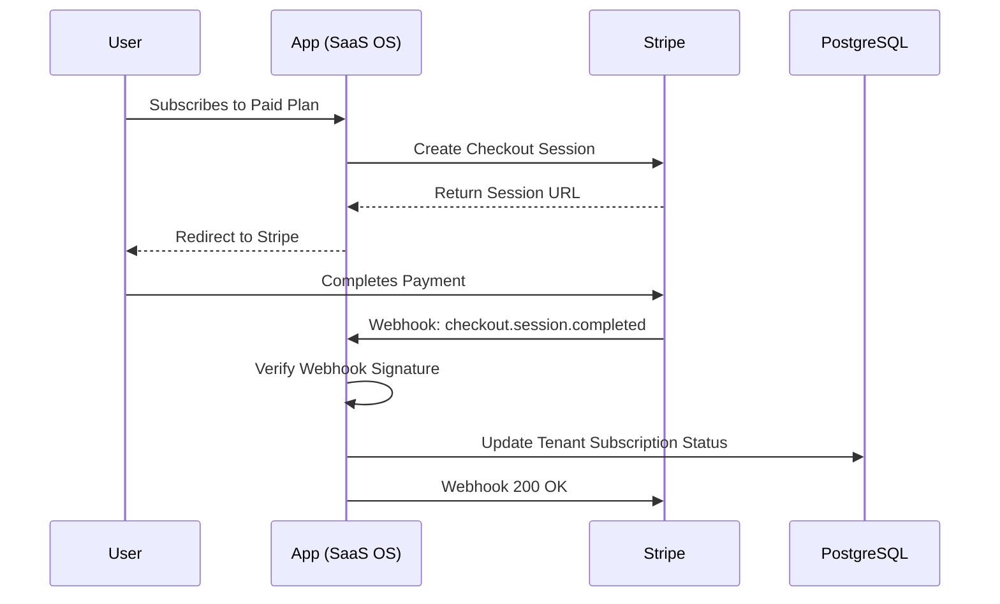
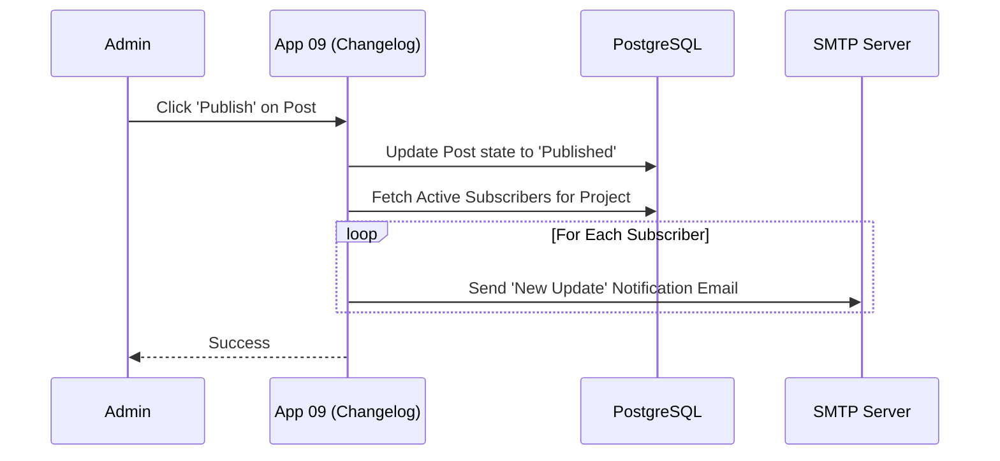

# Sequence Flows

## Subscription Creation Flow (Stripe Webhook)

```mermaid
sequenceDiagram
    participant User
    participant App as App (SaaS OS)
    participant Stripe
    participant DB as PostgreSQL
    
    User->>App: Subscribes to Paid Plan
    App->>Stripe: Create Checkout Session
    Stripe-->>App: Return Session URL
    App-->>User: Redirect to Stripe
    User->>Stripe: Completes Payment
    Stripe->>App: Webhook: checkout.session.completed
    App->>App: Verify Webhook Signature
    App->>DB: Update Tenant Subscription Status
    App->>Stripe: Webhook 200 OK
```

## Post Publishing & Notification Flow (App 09)

```mermaid
sequenceDiagram
    participant Admin
    participant App as App 09 (Changelog)
    participant DB as PostgreSQL
    participant Email as SMTP Server
    
    Admin->>App: Click 'Publish' on Post
    App->>DB: Update Post state to 'Published'
    App->>DB: Fetch Active Subscribers for Project
    loop For Each Subscriber
        App->>Email: Send 'New Update' Notification Email
    end
    App-->>Admin: Success
```
